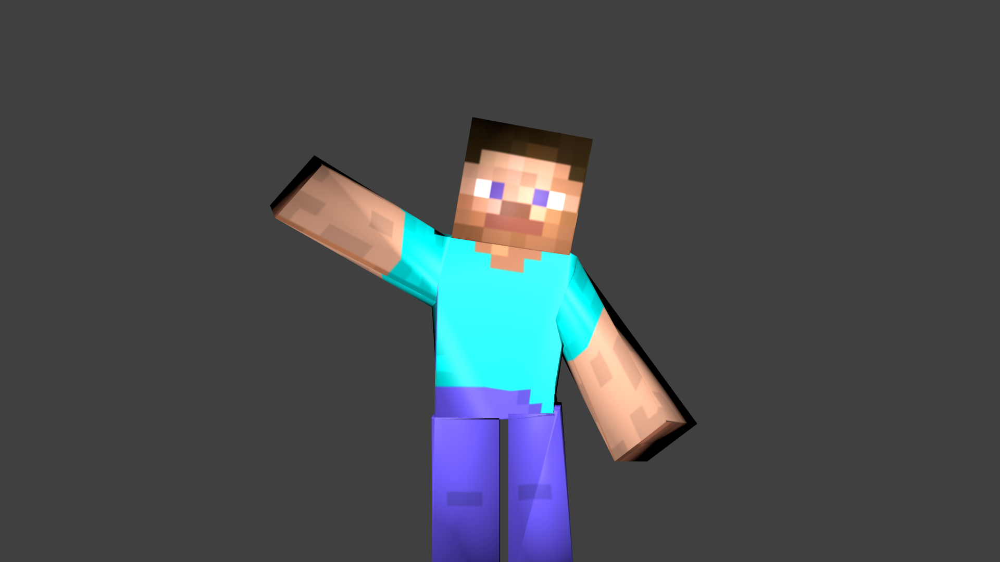
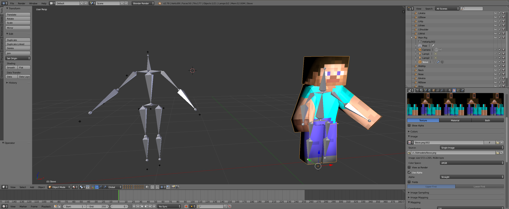

## Pose2avatar: Animate a 3D model using Blender and OpenPose






### Dependencies
* [Docker](https://gist.github.com/enric1994/3b5c20ddb2b4033c4498b92a71d909da)
* [Docker-Compose](https://gist.github.com/enric1994/3b5c20ddb2b4033c4498b92a71d909da)

### Usage
1. On the `docker` folder: `docker-compose up -d pose2avatar`
2. Access the container CLI: `docker exec -it pose2avatar bash`
3. Run the demo script: `python3 pose2avatar.py`

### How to generate your own keypoints (requires GPU and NVIDIA-Docker)
1. On the `docker` folder: `docker-compose up -d openpose
2. Access the container CLI: `docker exec -it openpose bash`
3. Edit the command to use your video:

```
./build/examples/openpose/openpose.bin --write_video /openpose/project/data/output_video.avi --video /openpose/project/data/yourvideo.mp4 --write_json /openpose/project/data/ --face --hand --hand_scale_number 6 --hand_scale_range 0.4
```
